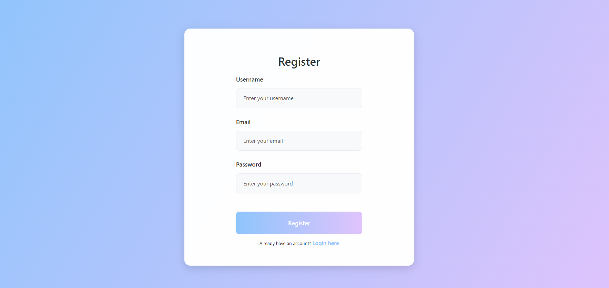
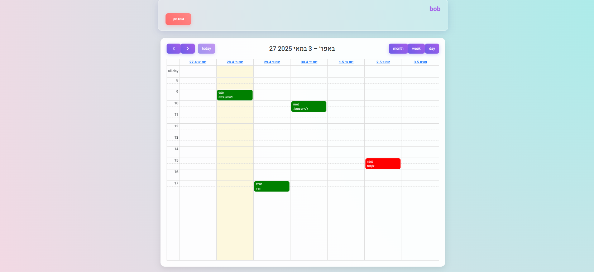

# Task Management Calendar Application

A web-based calendar application for managing tasks and assignments with user authentication.

## Features

- 👤 User Authentication (Register/Login)
- 📅 Interactive Calendar Interface
- ✏️ Task Management (Create, Edit, Delete)
- 🏷️ Task Categorization with Labels
- 🎨 Modern UI Design with Gradient Themes
- 📱 Responsive Design

## Technologies Used

### Frontend
- HTML5
- CSS3
  - CSS Grid & Flexbox
  - CSS Custom Properties
  - CSS Animations & Transitions
  - Media Queries for Responsiveness
- JavaScript (ES6+)
  - ES6 Modules
  - Event Handling
  - LocalStorage API

### Libraries & Frameworks
- Bootstrap 5.3.3
- FullCalendar 5.11.0
  
## Key Features Details

### User Management
- User registration with email and password
- User authentication
- Session management using LocalStorage

### Task Management
- Create new tasks with title, description, and due date
- Edit existing tasks
- Delete tasks
- Set task priority (High, Medium, Low)
- Set task status (Open, Completed, Cancelled)
- Add labels for task categorization

### Calendar Features
- Weekly/Monthly/Daily views
- Time-slot selection (8:00 AM - 6:00 PM)
- Color-coded tasks based on status
- Interactive task editing
- Drag and drop support

## Getting Started

1. Clone the repository
2. Open `homePage.html` in a modern web browser
3. Register a new account or use the demo account:
   - Email: bob@example.com
   - Password: 123456

# Task Management Calendar Application

[Previous content remains the same...]

## Screenshots

### Login Page

### Registration Page

### Calendar View

[Rest of the content remains the same...]
